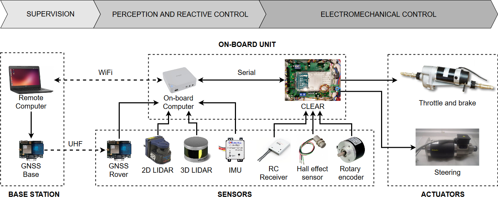

# CLEAR
This repository contains the software and electronic designs developed for the CLEAR (Control Logic for Easy Ackermann Robotization) project.

**Related publications**

del Pino, I., Munoz-Banon, M. A., Cova-Rocamora, S., Contreras, M. A., Candelas, F. A., & Torres, F. (2020). Deeper in BLUE. Journal of Intelligent & Robotic Systems, 98(1), 207-225.

Citation:
``` 
@article{del2020deeper,
  title={Deeper in BLUE},
  author={del Pino, Ivan and Munoz-Banon, Miguel A and Cova-Rocamora, Saul and Contreras, Miguel A and Candelas, Francisco A and Torres, Fernando},
  journal={Journal of Intelligent \& Robotic Systems},
  volume={98},
  number={1},
  pages={207--225},
  year={2020},
  publisher={Springer}
}
``` 

Cova Rocamora, S., Pino, I. D., Muñoz Bañon, M. A., Contreras, M. Á., Candelas, F. A., & Torres, F. (2018). CLEAR. Un módulo para la robotización de máquinas Ackermann. Actas de las XXXIX Jornadas de Automática, Badajoz, 5-7 de Septiembre de 2018.

Citation:
```
@inproceedings{cova2018clear,
  title={CLEAR. Un m{\'o}dulo para la robotizaci{\'o}n de m{\'a}quinas Ackermann},
  author={Cova-Rocamora, Sa{\'u}l and Pino, Iv{\'a}n del and Munoz-Banon, Miguel {\'A} and Contreras, Miguel {\'A} and Candelas, Francisco A and Torres, Fernando},
  booktitle={XXXIX Jornadas de Autom{\'a}tica},
  pages={372--378},
  year={2018},
  organization={{\'A}rea de Ingenier{\'\i}a de Sistemas y Autom{\'a}tica, Universidad de Extremadura}
}
```



The aim of this project is to gather in a single module all the common features needed to integrate an Ackermann (or car-like) robot in ROS. It contains a finite state machine that switches between different operational modes, namely, Remote Control Safe, Remote Control NOT safe, ROS control and Emergency Stop. Attending to the operational mode, the vehicle will accept commands from the active controller, either ROS or RC. Safety signals will override any command, limiting the vehicle speed or stoping it (reactive safety system not taken into account only in "Remote Control NOT safe" mode) or even putting the vehicle in Emergency mode if some critical signals are lost (ros communication, RC, etc).
CLEAR module sees the hardware through objects of different classes that implement the hardware interface. With this approach we can change any hardware element easily, just changing the descriptor header file that contains the constant values that are hardware dependent, and readjusting the controller gains if needed. 
Finally the rest of the system, that is, the high level, is seen as a ROS interface, so for the micro-controller is indifferent if the commands are generated autonomously or by a human teleoperator.

The interface between the CLEAR module and the on-board computer is implemented through ROS topics using the _rosserial_ command. These topics are described below: 
  
**desired_verbose_level**  
This topic sets the level of debugging information that is transmitted through the micro-controller serial port.  

**desired_ackermann_state**   
This topic sets the desired values for the low level controllers, using an Ackermann message. This message, as defined by the [Ackermann Interest Group](http://wiki.ros.org/Ackermann%20Group), consists of linear velocity, acceleration and jerk, and steering angle and rate. At the moment only the speed (linear velocity in meters per second) and the steering angle position (in degrees) are used to feed the controllers (i.e. you can not control the steering rate, but you can control the steering angle).

**estimated_ackermann_state**    
This Ackermann message contains the Ackermann values discussed before (linear velocity, acceleration...) estimated using an EKF that relies in the control signals for the prediction and the available sensors (steering encoder, limit switches and a Hall effect sensor) to perform the correction stage. This information is sent to the high level system through the ROS interface. 

**desired_speed_gains**  
This topic enables the on-line adjustment of the low level speed controller.

**desired_steering_gains**  
To dynamically adjust the low level steering controller.

**speed_volts_and_steering_pwm**  
This topic shows the actual outputs that feed the actuators, so it gives the lower level information available to debug the low level controllers. (only published if verbose level = debug)
 
**CLEAR_status**  
This topic is composed by five values: the _operational mode_ (emergency, ROS control, remote control safe and remote control NOT safe), the _error_ and two _warning_ codes (interface warnings and robot warnings) and the _verbose level_ selected. 

In addition, every _desired_ topic produces an _echo_ topic to check communications. (only published if verbose level = debug)


### Setup instructions

* Install Visual Studio Code

* Install PlatformIO extension in VS Code: launch VS Code - Extensions - search PlatformIO - click Install

* Clone this repository

* In VS Code, go to Open folder and select aurova_clear.

* Edit the file platformio.ini, setting upload_port to the port where the Arduino board is connected. 

* In the left bar menu, select PlatformIO. You can select there Build and Upload.

* It's also possible to search in the Command Palette (Ctrl+Shift+P) the commands PlatformIO:Build and PlatformIO:Upload.

To check everything is fine just build the project!

### Web resources

Ubuntu download: https://www.ubuntu.com/download/desktop

ROS download: http://wiki.ros.org/kinetic/Installation/Ubuntu

Coding style: http://wiki.ros.org/CppStyleGuide

Visual Studio dowload: https://code.visualstudio.com/

Install PlatformIO: https://platformio.org/

Install Doxygen: type in the terminal `sudo apt-get install doxygen`

How to document the code for Doxygen: https://www.stack.nl/~dimitri/doxygen/manual/docblocks.html

Version Control with Git course: https://www.udacity.com/course/version-control-with-git--ud123

GitHub & Collaboration course: https://www.udacity.com/course/github-collaboration--ud456
